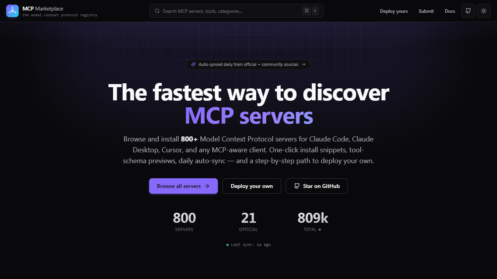

<div align="center">

# MCP Marketplace

<p align="center">
  <a href="https://mcp-hub-registry.vercel.app"></a>
</p>

### The registry of Model Context Protocol servers.

**Browse, search, and install MCP servers in seconds.** Auto-synced daily from official + community sources. Built for Claude Code, Claude Desktop, Cursor, and any MCP-aware client.

[](https://github.com/vaibhav4046/mcp-marketplace/actions)
[](https://github.com/vaibhav4046/mcp-marketplace/actions/workflows/sync.yml)
[](LICENSE)

</div>

---

## Why this exists

The Model Context Protocol shipped fast and the server ecosystem is sprawling. The official list is plain Markdown. Other indexes paywall it or wrap it in noise. This marketplace is a clean, fast, dev-first registry:

- **One-click install snippets** for Claude Code, Claude Desktop, Docker, raw CLI
- **Tool-schema previews** before you install
- **Filter by runtime, category, auth-required** — find what you can run today
- **Auto-synced daily** from upstream registries (Glama API + official MCP repo)
- **Zero tracking, zero auth-walls.** Open source, MIT.

---

## Features

| | |
|---|---|
| **⌘K command palette** | Fuzzy search 30+ servers in one keystroke |
| **Faceted browse** | Category chips, runtime filter, auth filter, sort by popular/recent/alpha |
| **Server detail pages** | Full description, install snippets, tool list with input schemas, related servers |
| **One-click install** | Copy a Claude Desktop JSON block, a Claude Code add command, or a raw CLI snippet |
| **Auto-sync daily** | GitHub Action pulls new entries from Glama + official repo and commits the diff |
| **Submit a server** | Open a PR or issue, optional auto-merge after review |
| **Modern UI** | Dark + light, keyboard-first, no jank, accessible focus states, Tailwind + Lucide icons |
| **Static + fast** | Next.js 15 App Router, RSC by default, generateStaticParams for detail pages |

---

## Quick start

```bash
git clone https://github.com/vaibhav4046/mcp-marketplace.git
cd mcp-marketplace
npm install
npm run dev
# open http://localhost:3000
```

That's it. Registry data lives in `data/servers.json` and is rendered server-side.

### Run a sync locally

```bash
npm run sync
# or, dry-run without writing:
npm run sync -- --dry
```

---

## Architecture

```
┌─────────────────────────────────────────────────────────────┐
│  data/servers.json  ←────  scripts/sync.ts (daily action)   │
│         │                                                   │
│         ▼                                                   │
│  lib/data.ts  →  cached selectors (featured, trending, …)   │
│         │                                                   │
│         ▼                                                   │
│  app/page.tsx  →  hero + featured + side panels + grid      │
│  app/server/[slug]/page.tsx  →  detail with install + tools │
│  components/command-palette.tsx  →  ⌘K Fuse.js search       │
└─────────────────────────────────────────────────────────────┘
```

**Sync sources:**

1. [`glama.ai/api/mcp/v1/servers`](https://glama.ai) — community-curated MCP API (titles, repo URLs, tags, stars).
2. [`modelcontextprotocol/servers/README.md`](https://github.com/modelcontextprotocol/servers) — official + reference list, parsed.
3. `data/servers.seed.json` (optional) — manual entries the sync should always include.

The merge prefers manual / official entries over auto-pulled ones, so a richly described entry never gets clobbered.

---

## File layout

```
mcp-marketplace/
├── app/
│   ├── layout.tsx              Root layout · ThemeProvider · CommandPalette · header / footer
│   ├── page.tsx                Hero + featured + trending + recent + browse
│   ├── server/[slug]/page.tsx  Server detail (RSC, generateStaticParams)
│   ├── server/[slug]/not-found.tsx
│   ├── submit/page.tsx         How to submit a server
│   └── globals.css             Design tokens (CSS vars), utilities
├── components/
│   ├── header.tsx              Sticky glass header
│   ├── theme-toggle.tsx
│   ├── command-palette.tsx     ⌘K Fuse.js fuzzy search
│   ├── server-card.tsx
│   ├── server-grid.tsx         Filters + sort + grid
│   ├── install-tabs.tsx        Per-client install snippets
│   ├── tool-list.tsx           Expandable tools with input schemas
│   └── ui/                     Button, Badge, Card, Tabs, CodeBlock, Skeleton
├── lib/
│   ├── types.ts                MCPServer, ServerCategory, Runtime, Transport
│   ├── data.ts                 Cached selectors over the JSON registry
│   └── utils.ts                cn, formatCount, timeAgo, slugify, copyToClipboard
├── data/
│   └── servers.json            The registry. Hand-curated + auto-synced.
├── scripts/
│   └── sync.ts                 Daily merge from Glama + official repo
├── .github/
│   ├── workflows/sync.yml      Cron job
│   ├── workflows/ci.yml        Typecheck + build on push
│   └── ISSUE_TEMPLATE/submit-server.md
├── tailwind.config.ts          Design tokens
├── next.config.ts
└── tsconfig.json
```

---

## Submit a server

Two paths, both painless.

### A. Open a PR

Edit `data/servers.json`, add an entry, open the PR. The CI typechecks the file shape. Merge once approved.

### B. File an issue

Use the [submit-server template](.github/ISSUE_TEMPLATE/submit-server.md). A curator (or the next sync run) will pick it up.

### Entry shape (minimum)

```json
{
  "slug": "my-server",
  "name": "My Server",
  "tagline": "One-line elevator pitch.",
  "author": "You",
  "authorGithub": "yourhandle",
  "repo": "https://github.com/you/my-server",
  "runtime": "node",
  "transports": ["stdio"],
  "categories": ["productivity"],
  "tags": [],
  "install": {
    "claudeDesktop": {
      "command": "npx",
      "args": ["-y", "my-server"]
    }
  }
}
```

Full schema in [`lib/types.ts`](lib/types.ts).

---

## Deploy

Optimized for Vercel (zero config). Any Node host works.

```bash
npm run build
npm run start
```

Set the GitHub Actions `GITHUB_TOKEN` (auto-injected by Actions, nothing to do) — the sync workflow uses it to commit registry updates back to the repo.

---

## Roadmap

- [ ] Live tool-schema fetch (call `tools/list` against running servers)
- [ ] Per-server install counters (anonymous opt-in)
- [ ] Compare 2 servers side-by-side
- [ ] OG image generator with server-specific branding
- [ ] Supabase backend for user-submitted servers + voting
- [ ] Browser extension that sets up Claude Desktop config in one click

---

## Contributing

PRs welcome. The codebase is plain TypeScript + Tailwind, no build wizardry. See [CONTRIBUTING.md](CONTRIBUTING.md).

---

## Credits

- [Anthropic](https://anthropic.com) — the [Model Context Protocol](https://modelcontextprotocol.io) and reference servers.
- [Glama](https://glama.ai) — community MCP registry whose public API powers the daily sync.
- Every author who shipped an MCP server.

---

## License

[MIT](LICENSE)

---

<div align="center">
  Built by <a href="https://github.com/vaibhav4046">Vaibhav Lalwani</a> · Not affiliated with Anthropic.
</div>
